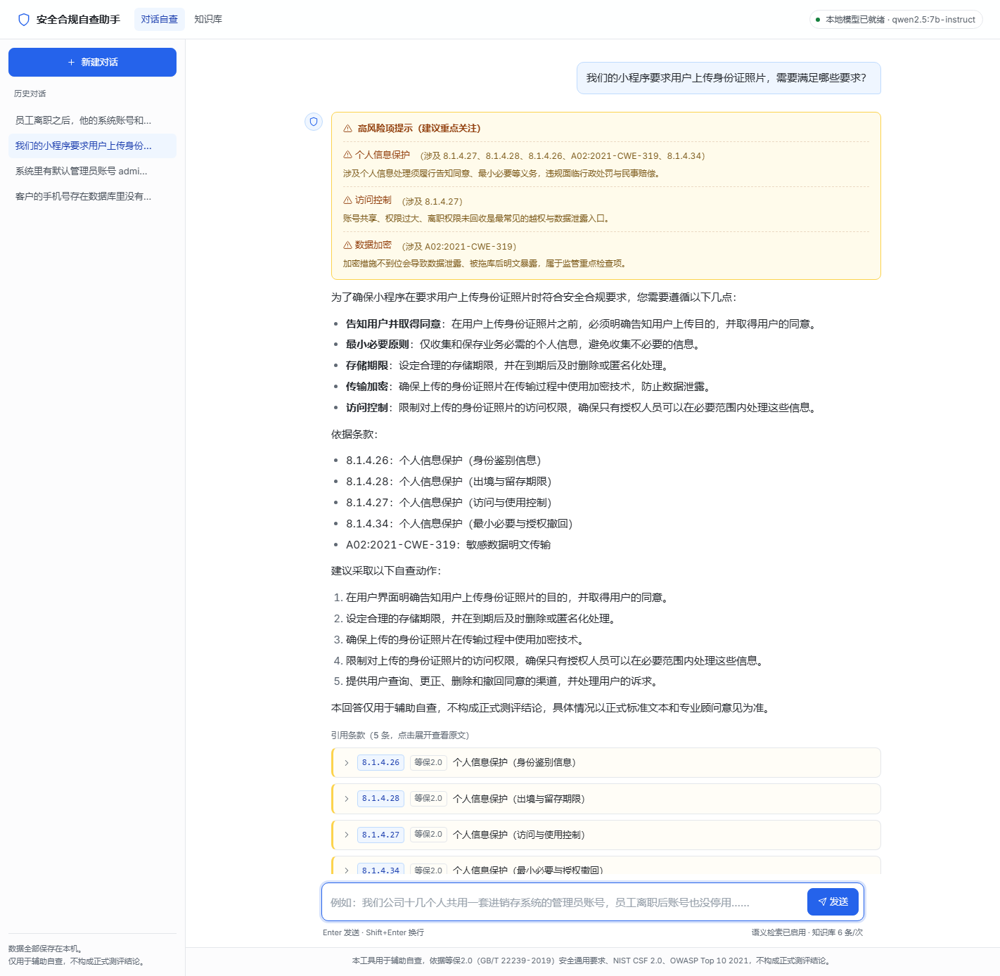
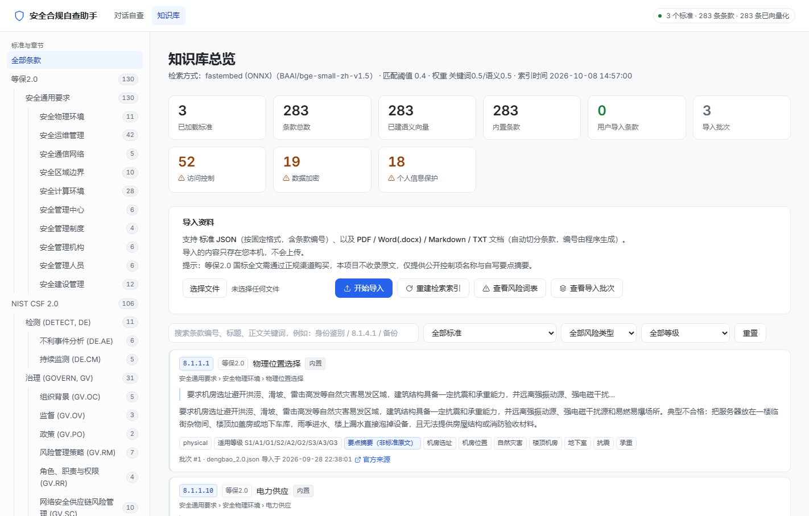

# 安全合规自查助手

[](https://github.com/jiatingchen0412-creator/compliance-assistant/actions/workflows/ci.yml)
[](LICENSE)

一个装在自己电脑上的小工具：**用大白话描述你的系统情况，它从等保2.0、NIST CSF 2.0、OWASP Top 10 2021 里找出对应的条款回给你**，带条款编号和原文，涉及数据加密、访问控制、个人信息保护时会用 ⚠️ 标出来。

- 完全在本机运行，你的描述不会上传到任何服务器
- 知识库里没有的，会直接说"未找到"，并建议咨询专业安全顾问，**不会编造条款号**
- 你点名问一部它没收录的法规（比如《个人信息保护法》），它会明说"这部分没收录"，**也不会凭记忆转述条文**
- 你描述的信息不够时，它会先问你几个问题，而不是硬答——并且**不会顺便给你的情况下结论**
- 问"哪些条款对我适用"这类问题，它不会硬凑一份清单，而是告诉你需要先知道哪些信息

> ⚠️ 免责声明：本工具用于**辅助自查**，输出的是"你这种情况可能涉及哪些条款"，**不构成正式测评结论，也不构成法律意见**。涉及数据加密、访问控制、个人信息保护的具体做法，建议咨询专业安全顾问或律师。

---

## 界面长这样



问一句，先给高风险项提示和条款依据，再给分析和建议动作——每条引用都能点开看条款原文。历史对话只存在本机。
（图里的历史会话是示例数据，不是真实用户记录。）

<details>
<summary>知识库管理界面（点开看）</summary>



283 条内置条款，可以按标准、风险类型、等级筛选；也能导入自己的资料，误导了能一键撤销。

</details>

---


## 📁 文档索引（想深入了解就看这里）

这个项目有三类文档，分工很明确：

| 文件夹 | 管什么 | 什么时候看 |
|---|---|---|
| **根目录 `README.md`** | 怎么用（你正在看的这份） | 第一次使用 |
| **`docs/`** | **标准规范**：应该做成什么样、为什么这么做 | 想改功能、想了解设计 |
| **`devlog/`** | **开发日志**：每天做了什么、还剩什么 | 想知道进展、回顾决策 |

另外两份在根目录：

| 文件 | 内容 |
|---|---|
| `CHANGELOG.md` | **版本变更记录**：每个版本新增/修复/变更了什么，以及为什么 |
| `CLAUDE.md` | **给 AI 编码助手（和接手的人）的项目说明**：先读什么、工作循环、三条铁律、指标红线、已知的坑 |

### docs/ 里的 10 份标准文件

| 文件 | 内容 | 建议阅读顺序 |
|---|---|---|
| `docs/README.md` | 文档索引 + 工作说明 | ① |
| `docs/00-项目简报.md` | **一页看懂**：做什么、当前状态、质量数据、限制、下一步 | **想快速了解全貌先看这个** |
| `docs/01-需求规格说明.md` | 要做成什么样、明确不做什么、三条底线 | ② |
| `docs/02-技术方案.md` | 架构、技术选型理由、三个关键设计（检索打分 / 防幻觉 / found 归属） | ③ |
| `docs/03-界面设计规范.md` | 配色变量、字号、组件样式、文案规范 | 改界面时 |
| `docs/04-知识库数据规范.md` | 条款字段定义、风险标签、**版权红线**、索引怎么建 | 加条款时 |
| `docs/05-问答与防幻觉规范.md` | 回答六条规则、引用解析、⚠️ 判定、降级策略 | 改提示词时 |
| `docs/06-开发步骤与里程碑.md` | **先做什么后做什么、怎么算完成、指标红线** | 动代码前必看 |
| `docs/07-测试与验收规范.md` | 分层测试、指标红线、人工验收清单、盲区 | 交付前 |
| `docs/08-运维手册.md` | 故障速查（症状→原因→怎么办）、配置说明 | 用不了的时候 |

### devlog/ 开发日志

- **一天一个文件**：`devlog/2026-09-28.md`
- 五个固定小节：今日目标 / 已完成 / 待办 / 问题与决策 / 自动记录
- **自动部分**：每次启动服务都会自动创建当天的日志文件，并追加一条启动记录（时间、知识库规模、模型状态）
- **手动部分**：用命令行追加，或直接用记事本编辑

```bat
rem 记一条已完成
.venv\Scripts\python.exe tools\devlog.py done "完成检索阈值标定，召回率 25/25"

rem 记一条待办
.venv\Scripts\python.exe tools\devlog.py todo "给长对话加上下文压缩"

rem 看今天的日志 / 汇总最近 7 天
.venv\Scripts\python.exe tools\devlog.py show
.venv\Scripts\python.exe tools\devlog.py summary --days 7
```

### 开发工作说明（想改代码的话）

**工作循环**：

```
① 开工前 → 在 devlog 写「今日目标」
② 只做一步 → 按 docs/06 的步骤编号，一次只推进一个步骤
③ 自测 → 跑 tests\run_eval.py，指标不能退步
④ 真实验收 → 打开浏览器亲手用一遍
⑤ 记录 → devlog 写「已完成」和「问题与决策」
⑥ 停下来 → 给人看，确认后再进下一步
```

**三条铁律**：

1. **一步只动一个模块** —— 出问题时能立刻知道是哪次改动引起的
2. **不跑评测不算完成** —— 这个项目的核心是"答得准不准"，没指标就是拍脑袋
3. **规范变了先改 docs** —— 否则过两周没人记得当初为什么这么设计

**指标红线**（任何改动都不能跌破）：

| 指标 | 红线 | 当前 |
|---|---|---|
| 拒答正确率 | **必须 5/5**（一票否决） | 5/5 |
| 库外法规识别率 | **必须 6/6**（一票否决） | 6/6 |
| 适用性判定拦截率 | **必须 4/4**（一票否决） | 4/4 |
| 检索召回率 | ≥ 27/29 | 29/29 |
| ⚠️ 风险标注率 | ≥ 8/9 | 9/9 |
| ⚠️ 误标率 | 误标 ≤ 0 处 | 0 处 |
| 追问正确率 | ≥ 2/4 | 4/4 |
| 单次回答耗时 | ≤ 10 秒 | 1.3 ~ 4.3 秒（首字 0.4~0.7 秒） |

三条一票否决项（拒答、库外法规、适用性判定）必须全对——这三类答错的后果是"用户拿着错信息去决策"，没有"差不多"的余地。

**改完代码按顺序跑这些测试套件**（全部退出码 0 才算过）：

```bat
.venv\Scripts\python.exe tests\check_syntax.py       rem 静态检查（最先跑）
.venv\Scripts\python.exe tests\run_eval.py --no-llm  rem 检索与判定质量（不需要 Ollama，秒级）
.venv\Scripts\python.exe tests\run_eval.py           rem 加上端到端那一层（需要 Ollama，分钟级）
.venv\Scripts\python.exe tests\test_scope.py         rem 问题范围判定（库外法规 / 适用性 / 追问）
.venv\Scripts\python.exe tests\test_guard.py         rem ⚠️ 风险判定与库外法规转述清理
.venv\Scripts\python.exe tests\test_normalize.py     rem 分词与口语映射
.venv\Scripts\python.exe tests\test_edge_cases.py    rem 异常路径
.venv\Scripts\python.exe tests\test_revert.py        rem 导入与撤销（用临时库，不动真实数据）
.venv\Scripts\python.exe tests\test_streaming.py     rem 流式输出
.venv\Scripts\python.exe tests\test_export.py        rem Word 导出
.venv\Scripts\python.exe tests\test_frontend.py      rem 界面（真实 Chrome 渲染，查无障碍与 JS 报错）
```

上面这段是**全部要跑的**：9 个自动化套件（99 个用例）加 `run_eval.py` 的两档（44 题评测），**都不需要 Ollama 也能跑**——关键的防幻觉保证都在服务端代码里，所以能离线证明它们成立。

`test_frontend.py` 会真的拉起一个临时端口的服务、用本机 Chrome 把页面渲染出来，再跑 axe-core 无障碍扫描，检查：JS 有没有报错、有没有无障碍违规、标题层级、历史对话和目录树能不能用键盘操作、Inter 字体加载了没有、390px 手机上有没有横向溢出、抽屉导航能不能开合。**它有额外前提**：本机要装 Node.js 和 Chrome（缺任何一个会直接判失败并告诉你缺什么，不会假装通过）。测试用的是**数据库的临时副本**，不会动你的历史记录。

> 为什么单独做这一套：之前只验证"HTTP 返回 200"，结果 `web/js/kb.js` 里一个非法 JS 变量名让整个知识库页在浏览器里失效了好久都没被发现。**语法正确 ≠ 页面能用**，所以现在用真浏览器兜底。

**这些测试每次推送都会自动跑一遍**（GitHub Actions，见 `.github/workflows/ci.yml`）：
在 Windows 和 Linux 上各跑一遍后端 8 个套件，再在 Linux 上用真 Chrome 跑一遍界面套件。
首页徽章就是它的状态。全新 clone 下来跑 CI 的第一步是 `tools/build_index.py`——
它会从 `data/seed` 里导入 283 条种子条款并建好索引，所以检出后不需要任何手工准备。

**一键体检**（服务在跑时用）：

```bat
.venv\Scripts\python.exe tools\health_check.py
```

完整规范见 `docs/06-开发步骤与里程碑.md`。

---

## 一、第一次使用

### 0. 先把代码拿到本机

```bash
git clone https://github.com/jiatingchen0412-creator/compliance-assistant.git
cd compliance-assistant
```

没有 git 的话，在仓库页面点绿色的 **Code → Download ZIP**，解压到任意目录也行。
**路径里尽量不要有空格或奇怪的符号**，放 `D:\compliance-assistant` 这种最省事。

> 仓库里**没有**大模型文件和你的数据（这些都在 `.gitignore` 里），所以下载很快，几 MB 而已。

### 1. 启动

双击 **`启动助手.bat`**。

- 第一次运行会自动完成四件事：生成 `.env` 配置文件 → 创建运行环境 → 安装依赖 → 启动服务，**大约需要 3–5 分钟**，请耐心等待窗口里的提示
- 之后每次启动只需几秒
- 启动完成后浏览器会自动打开 `http://127.0.0.1:8765`

### 2. 安装本地大模型（必做一次）

本工具用 **Ollama** 在本地跑大模型，不需要联网、不花钱。

**第一步**：确认电脑装了 Ollama —— 开始菜单里能找到「Ollama」就说明装了。没装的话去 <https://ollama.com/download> 下载安装。

**第二步**：下载模型。打开「命令提示符」（按 `Win + R`，输入 `cmd` 回车），粘贴下面这行并回车：

```
ollama pull qwen2.5:7b-instruct
```

这会下载约 **4.7GB** 的模型文件。下载完成后不用重启电脑。

> **如果官方源太慢或卡住**（国内常见，实测只有 4–5 MB/s 且最后的分片容易失败）：
> 用项目自带的高速下载脚本，从国内镜像站拉同一个模型，实测 **41 MB/s，两分钟下完**：
> ```
> .venv\Scripts\python.exe tools\fetch_model.py
> .venv\Scripts\python.exe tools\register_model.py
> ```
> 第一个命令下载 GGUF 文件，第二个把它注册到 Ollama。两个命令跑完效果与 `ollama pull` 完全一样。

**第三步**：刷新浏览器页面，右上角状态变成「本地模型已就绪」就成功了。

> **没装模型也能用**：此时工具会自动降级为"只检索条款、不做 AI 总结"，照样给出条款编号和原文，只是没有针对你情况的分析。

**显存不够怎么办**：如果你的显卡显存小于 6GB，把命令里的 `qwen2.5:7b-instruct` 换成 `qwen2.5:3b-instruct`，然后打开项目里的 `.env` 文件，把 `LLM_MODEL=` 后面也改成一样的名字。

---

## 二、怎么用

### 对话自查

打开后是聊天界面，直接说人话就行：

> 我们公司十几个人都用同一个管理员账号登录进销存系统，有问题吗？

> 客户的手机号存在数据库里没有加密，需要注意什么？

> 员工离职后账号权限一直没回收，合规上有什么要求？

首页还有 8 个常见问题的快捷入口，点一下就问。

**回答的结构**：

1. 顶部 ⚠️ 高风险提示（如果有）
2. 结论和依据
3. 下方一排**引用条款卡片**，点一下展开看该条款的原文（或要点摘要）
4. 如果信息不够，会列出几个问题让你点选补充

每条回答下面有「复制回答」「导出 Markdown」「导出 Word 报告」。Word 报告是完整文档：封面、⚠️ 风险汇总、逐条问答、引用条款附录、免责声明，可以直接发给顾问或存档。

左侧是历史对话，点「＋ 新建对话」开始新一轮。

### 知识库管理

点右上角「**知识库**」：

- 看得到**已经加载了哪些条款**：左边是按标准 → 章节 → 子章节展开的目录树，带条数
- 顶部统计卡：几个标准、多少条款、多少条已建语义向量、内置 vs 用户导入各多少条，以及三类 ⚠️ 高风险条款各有多少
- 搜索框可以按条款编号、标题、正文关键词搜（比如输入 `身份鉴别` 或 `8.1.4.1`）
- 可按标准、风险类型、适用等级（等保一级/二级/三级）筛选
- 每条条款都标了**来源**：「内置」（项目自带的种子数据）还是「用户导入」（你自己上传的），内置的还带官方链接，用户导入的带批次号
- 点「查看导入批次」能看到每次导入的来源、条数和时间，**最近一次导入可以一键撤销**

### 导入出错怎么办

导入前系统会**自动备份数据库**，所以：

- 导入错了 → 知识库页 → 「查看导入批次」→ 点「撤销这次导入」，知识库退回导入前的状态
- 撤销本身也会再备份一次当前状态，所以撤错了还能找回来
- 备份文件在 `data\backups\`，保留最近 20 份
- **只允许撤销最近一次**导入：恢复备份会把之后的改动一起退掉，允许撤销任意一次容易造成误解
- **内置种子不允许撤销**（那是知识库的基线），要移除请用「删除标准」

---

## 三、导入自己的合规资料

工具导入的功能支持两种：

**1. 标准 JSON** —— 按 `data/seed/_SCHEMA.md` 里规定的格式写，带正规条款编号。适合你有结构化的条款数据。

**2. 普通文档** —— PDF / Word(`.docx`) / Markdown / TXT。程序会按"标题行"自动切分成条款，**编号由程序生成**（形如 `IMP-文件名-01`），请自己核对。

在知识库页面直接选文件上传即可，也可以用命令行批量导入：

```
.venv\Scripts\python.exe tools\import_doc.py "D:\我的资料\*.pdf"
```

导入后会自动重建索引，刷新页面就能搜到。

> **关于等保2.0 原文**：GB/T 22239-2019 是付费国家标准，全文不公开。本项目**不收录国标原文**，种子库里只有公开流传的控制项名称（如"身份鉴别""数据保密性"）和**自行改写的要点摘要**，并标注了"以正式标准文本为准"。如果你购买了标准全文或从测评机构拿到了资料，可以自己导入，工具会按你自己的资料来检索。

---

## 四、数据在哪，怎么备份

所有数据都在项目文件夹里：

| 文件 | 内容 |
|---|---|
| `data\app.db` | **知识库 + 全部聊天记录**，唯一需要备份的文件 |
| `data\seed\*.json` | 种子条款数据 |
| `data\models\` | 中文语义模型缓存（约 100MB，删了会自动重下） |
| `.env` | 你的配置 |

**备份**：直接复制 `data\app.db` 一个文件就行。
**换电脑**：把整个文件夹拷过去，双击 `启动助手.bat` 即可。

---

## 五、配置说明

配置文件是项目根目录的 `.env`（第一次启动时自动从 `.env.example` 生成）。用记事本打开就能改，改完**重启服务**生效。

几个常改的：

| 配置项 | 作用 |
|---|---|
| `LLM_MODEL` | 用哪个模型，要和 `ollama list` 里的一致 |
| `APP_PORT` | 端口，默认 8765。被占用时改成别的 |
| `APP_AUTO_OPEN` | 启动后是否自动开浏览器 |
| `RETRIEVAL_MIN_SCORE` | 拒答阈值，默认 `0.40`。**调高更保守**（更容易说"找不到"），调低更容易命中 |
| `ENABLE_VECTOR_SEARCH` | 是否启用语义检索，设 `false` 则只用关键词（零下载） |
| `SAVE_HISTORY` | 是否保存聊天记录 |
| `LLM_TIMEOUT` | 大模型超时秒数，模型首次加载慢时可以调大到 300 |

---

## 六、常见问题

**Q：双击 `启动助手.bat` 什么都不发生，窗口一闪而过？**

先看**黑窗口里有没有文字**。如果窗口一闪就没，或者完全没反应，按下面顺序排查：

1. **确认服务是不是已经在跑了**。如果之前启动过、黑窗口还开着（或者最小化了），再双击不会重复启动，只会打开浏览器。
   想确认：任务栏找那个黑色窗口，标题是「安全合规自查助手」。

2. **手动运行看报错**。按 `Win + R`，输入 `cmd` 回车，然后粘贴这行：
   ```bat
   cd /d <项目所在目录> && 启动助手.bat
   ```
   这样即使出错窗口也不会关，能看到具体原因。

3. **最常见的原因**：没装 Python，或者装的时候没勾「Add python.exe to PATH」。
   装好后重新双击即可，脚本会自动创建运行环境并安装依赖。

4. **完全没有窗口出现**：可能是杀毒软件拦截了 .bat 文件。把它加进白名单。

> **给维护者的话（重要）**：`启动助手.bat` 和 `停用助手.bat` **必须保持纯英文 ASCII，不能写中文**。
> cmd.exe 按当前控制台代码页读 .bat 文件，文件里有中文而代码页不匹配时，命令会被撕碎
> （实测 `echo` 会被解析成 `ho`），表现就是**双击后完全没反应**。
> 中文提示一律交给 Python 输出（Python 用宽字符 API 写控制台，不受代码页影响）。
> 这条规则已加进 `tests/check_syntax.py`，改动后跑一次就能发现。
> 详细说明见 `tools/fix_bat_encoding.py` 头部的注释。

**Q：右上角一直显示「Ollama 未运行」？**
看看任务栏右下角有没有羊驼图标。没有的话，开始菜单搜 Ollama 打开它，或者重启一下电脑。工具自己也会尝试拉起 Ollama，等十几秒再刷新。

**Q：回答很慢？**
本地大模型靠显卡算。7B 模型在 RTX 3060 级别显卡上大约 3–10 秒。第一次提问会额外慢一些（要加载模型）。如果实在太慢，换 `qwen2.5:3b-instruct`。

**Q：回答里说"知识库中未找到"，但这明明是个合规问题？**
两种可能：一是确实不在已加载的三套标准覆盖范围内（比如你问的是《个人信息保护法》具体条文，而知识库里只有等保2.0 的个人信息保护条款）；二是描述太笼统。补充些细节再问，比如系统是否连外网、存了哪些数据、多少人用。也可以自己导入相关标准。

**Q：能不能不装大模型，只用条款检索？**
可以。不装模型时自动就是纯检索模式，照样给条款编号和原文。

**Q：怎么做一次完整回归测试？**
```
.venv\Scripts\python.exe tests\run_eval.py
```
会跑 44 道评测题，分两层：第一层查检索与判定质量（六项指标，不需要 Ollama，秒级），第二层是端到端（追问正确率、库外法规声明率，需要 Ollama，分钟级）。报告写到 `tests\eval_report.md`。

- 只想快速确认没改坏检索 → 加 `--no-llm` 跳过第二层
- 第二层太慢 → 加 `--limit 6` 只跑前 6 道

---

## 七、目录结构

```
compliance-assistant\
├── 启动助手.bat          # 双击这个启动
├── 停用助手.bat          # 关掉后台服务
├── README.md             # 本文件
├── LICENSE               # MIT 开源协议
├── .gitignore            # 哪些东西不进版本库（你的数据、大文件、.env）
├── requirements.txt      # 依赖清单
├── .env / .env.example   # 配置（.env 第一次启动自动生成，不进版本库）
│
├── docs\                 # ★ 标准规范文档（改东西之前先看这里）
│   ├── 00-项目简报.md          #   给不看代码的人看的一页总览
│   ├── README.md              #   文档索引 + 工作说明
│   ├── 01-需求规格说明.md      #   做什么、不做什么、三条底线
│   ├── 02-技术方案.md         #   架构、选型理由、关键设计
│   ├── 03-界面设计规范.md      #   配色变量、组件、文案规范
│   ├── 04-知识库数据规范.md    #   条款字段、风险标签、版权红线
│   ├── 05-问答与防幻觉规范.md  #   六条回答规则、引用解析、⚠️ 判定
│   ├── 06-开发步骤与里程碑.md  #   ★ 先做什么、怎么算完成
│   ├── 07-测试与验收规范.md    #   分层测试、指标红线、验收清单
│   └── 08-运维手册.md         #   故障速查、配置说明
│
├── devlog\               # ★ 开发日志（一天一个文件）
│   ├── README.md              #   日志规范
│   ├── TEMPLATE.md            #   日志模板（可自己改）
│   └── 2026-09-28.md          #   每天自动创建
│
├── app\                  # 后端
│   ├── main.py           #   总入口：起服务、挂载网页、首次自动建库
│   ├── __init__.py       #   导入即打开 UTF-8 输出（见 app\console.py）
│   ├── console.py        #   让中文/符号在 GBK 控制台和被重定向时都不崩
│   ├── config.py         #   配置读取
│   ├── db.py             #   SQLite 建表与读写
│   ├── models.py         #   接口数据结构
│   ├── normalize.py      #   中文分词 + 口语→术语映射（影响检索命中率）
│   ├── retrieval.py      #   ★ 混合检索：IDF关键词 ⊕ 语义向量
│   ├── scope.py          #   ★ 问题范围判定：库外法规 / 适用性判定 / 该不该追问
│   ├── prompt.py         #   ★ 提示词：引用规则、⚠️规则、追问规则
│   ├── guard.py          #   ★ 防幻觉：引用白名单校验、库外法规转述清理、高风险判定
│   ├── quality.py        #   质量守护：启动自检 + 指标红线判定
│   ├── llm.py            #   Ollama 调用、流式增量解析、降级与截断抢救
│   ├── ingest.py         #   知识库导入与索引构建
│   ├── backup.py         #   导入前的数据库快照与回滚
│   ├── export.py         #   Word 报告生成
│   ├── logging_setup.py  #   日志落盘（data\logs\app.log，自动轮转）
│   ├── devlog.py         #   开发日志读写（服务启动时自动调用）
│   └── routers\
│       ├── chat.py       #   提问、流式回答、会话、导出
│       └── kb.py         #   知识库浏览、搜索、导入、统计
│
├── web\                  # 前端（零构建，改完刷新即可）
│   ├── index.html        #   聊天页（顶部内置 SVG 图标雪碧图）
│   ├── kb.html           #   知识库页
│   ├── css\style.css     #   设计令牌 + 组件样式
│   ├── fonts\            #   Inter 可变字体（本地，断网也能用）
│   └── js\               #   api.js（含抽屉导航）/ chat.js / kb.js
│
├── data\
│   ├── app.db            #   ★ 你的知识库和聊天记录
│   ├── seed\             #   种子条款（等保/NIST/OWASP）+ 风险词表 + 格式规范
│   ├── backups\          #   导入前的自动快照（最多留 20 份，首次导入时才生成）
│   ├── logs\             #   运行日志（保留 14 天）
│   ├── models\           #   语义模型缓存
│   └── 示例自查报告.docx  #   导出的报告长什么样，可以先看看
│
├── tools\
│   ├── devlog.py         #   写开发日志
│   ├── health_check.py   #   一键体检（排查问题先跑这个）
│   ├── check_quality.py  #   质量自检（退出码可用于自动化）
│   ├── inspect_last_answer.py  # 查看最近一次问答的引用与 ⚠️ 依据
│   ├── sync_config.py    #   升级后补 .env 里缺的新配置项
│   ├── import_doc.py     #   命令行导入文档
│   ├── build_index.py    #   命令行重建索引
│   ├── fetch_model.py    #   高速下载大模型（国内镜像，41MB/s）
│   ├── register_model.py #   把下载的模型注册到 Ollama
│   ├── cdp_eval.js       #   用真实 Chrome 跑页面脚本（测试用，不依赖 puppeteer）
│   └── first_run.py / stop_service.py / fix_bat_encoding.py
│
└── tests\
    ├── check_syntax.py      # 静态检查：Python/JS 语法、JSON、元素ID、SVG图标、bat 纯 ASCII
    ├── eval_questions.json  # 44 道评测题（应召回 / 应拒答 / 库外法规 / 适用性判定 / 应追问）
    ├── run_eval.py          # 两层评测（检索与判定 + 端到端）+ 报告
    ├── test_scope.py        # 问题范围判定（13 个用例）
    ├── test_guard.py        # ⚠️ 风险判定与库外法规转述清理（11 个用例）
    ├── test_normalize.py    # 分词与口语映射（10 个用例）
    ├── test_edge_cases.py   # 异常路径（16 个用例）
    ├── test_revert.py       # 导入与撤销（10 个用例，用临时库）
    ├── test_streaming.py    # 流式输出（12 个用例）
    ├── test_export.py       # Word 导出（10 个用例）
    ├── test_frontend.py     # 界面：真 Chrome + axe 无障碍扫描（17 个用例）
    ├── frontend_probe.js    #   在页面里跑的采集探针（只取事实，判定在 Python 里）
    ├── vendor\axe.min.js    #   axe-core（仅测试用，不影响离线运行）
    └── eval_report.md       # 最近一次评测报告（生成物，跑评测才有）
```

**想改配色**：编辑 `web\css\style.css` 最上面的 `:root` 里的颜色变量（规范见 `docs/03`）。
**想加高风险关键词**：编辑 `data\seed\risk_terms.json`，然后在知识库页点「重建检索索引」。
**想让某些口语说法能搜到条款**：编辑 `app\normalize.py` 里的 `COLLOQUIAL_MAP`，然后重建索引。
**想加一部"常被问到但没收录"的法规**：编辑 `app\scope.py` 的 `OUT_OF_KB_REGULATIONS`，加一条（显示名、别名、说明）。
**想改回答规则**：先看 `docs/05-问答与防幻觉规范.md`，**这是风险最高的改动**，改完必须跑完整评测（两层都跑）。

---

## 八、知识库内容与版权

| 标准 | 收录方式 | 许可 |
|---|---|---|
| **NIST CSF 2.0** | 全部 106 个 Subcategory，英文原文 + 中文翻译 | 美国政府作品，公共领域 |
| **OWASP Top 10 2021** | 10 个主条目 + 37 个子条目 | CC BY-SA 4.0，署名 OWASP Foundation |
| **等保2.0（GB/T 22239-2019）** | 130 条，**仅公开控制项名称 + 自行改写的要点摘要** | 摘要为项目自写，非标准原文 |

等保2.0 条款的正文一律标注为「要点摘要（非标准原文）」，界面上也会显示这个标记。**请通过正规渠道购买标准全文**，一切以正式发布的标准文本为准。

---

## 九、开源许可与第三方组件

### 本项目

**MIT License** —— 见 [`LICENSE`](LICENSE)。

简单说：你可以随便用、随便改、拿去商用、再发布，只需要保留版权声明。
**但软件按"现状"提供，不附带任何担保**——它是一个自查辅助工具，不是测评结论，也不是法律意见。

### 随仓库分发的第三方内容

| 内容 | 位置 | 许可 | 说明 |
|---|---|---|---|
| **Inter 字体** | `web/fonts/` | SIL Open Font License 1.1 | 版权归 Google Inc.，许可证原文见 [`web/fonts/LICENSE-Inter.txt`](web/fonts/LICENSE-Inter.txt) |
| **axe-core** | `tests/vendor/axe.min.js` | Mozilla Public License 2.0 | 只用于自动化无障碍测试，**不进运行时**，页面加载不依赖它 |
| **NIST CSF 2.0 条款** | `data/seed/nist_csf_2.0.json` | 美国政府作品，公共领域 | 英文原文 + 中文翻译 |
| **OWASP Top 10 2021 条款** | `data/seed/owasp_top10_2021.json` | CC BY-SA 4.0 | 署名 **OWASP Foundation**；译文遵循同一许可 |
| **等保2.0 条款** | `data/seed/dengbao_2.0.json` | 项目自写摘要 | 只用了公开流传的控制项**名称**，正文是自行改写的要点，**不含国标原文** |

> ⚠️ 如果你是标准或资料的版权方，认为仓库里有内容不妥，请在 Issues 里说明，会立即处理。

